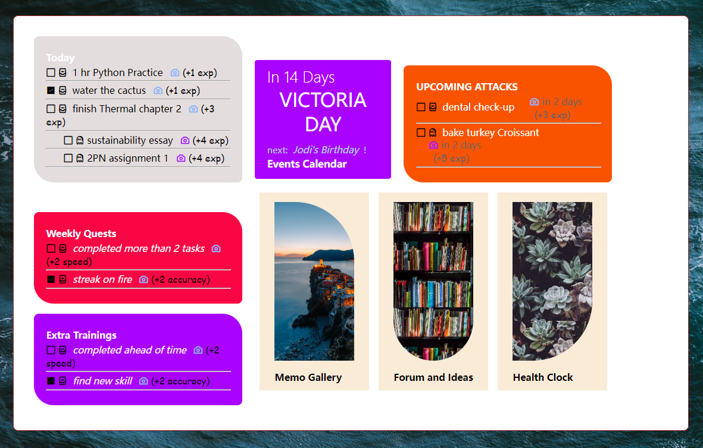
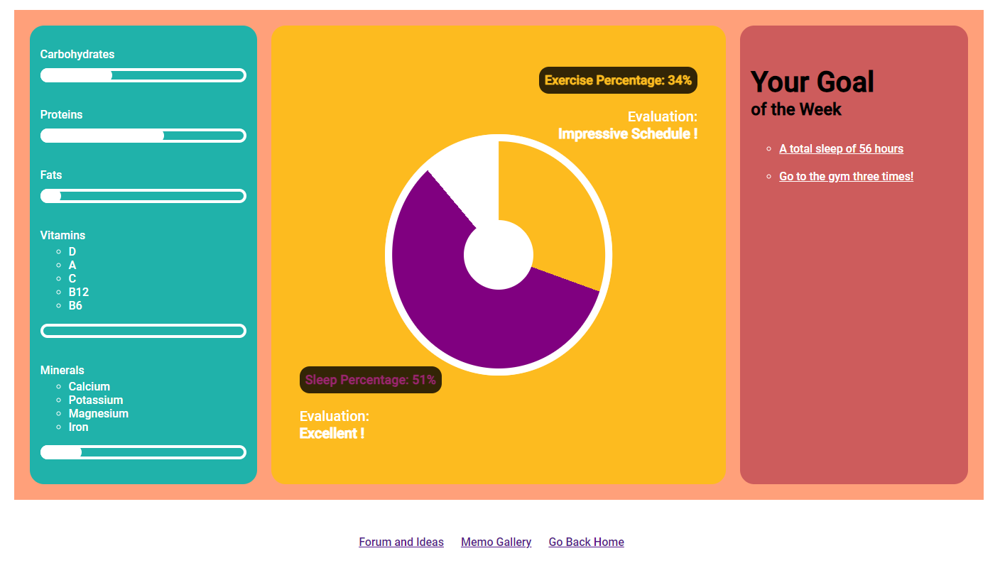
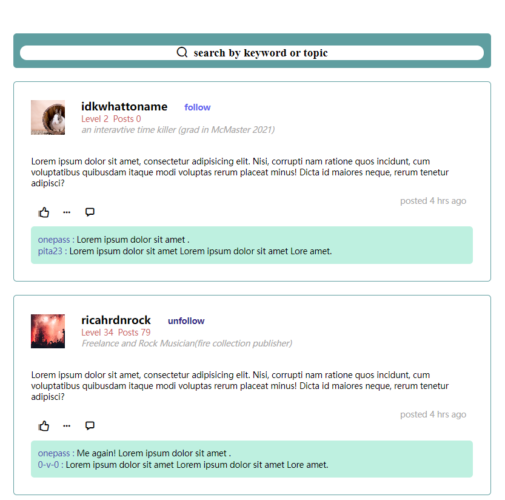
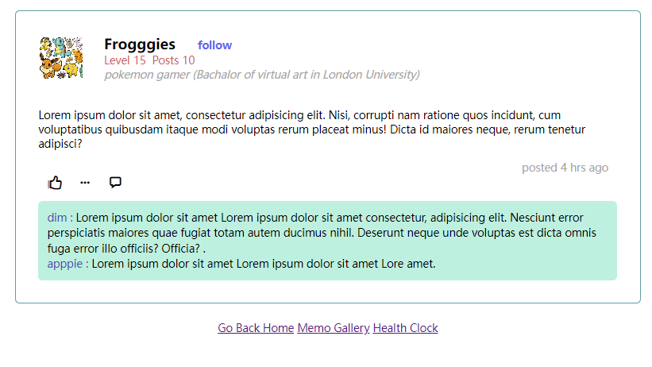
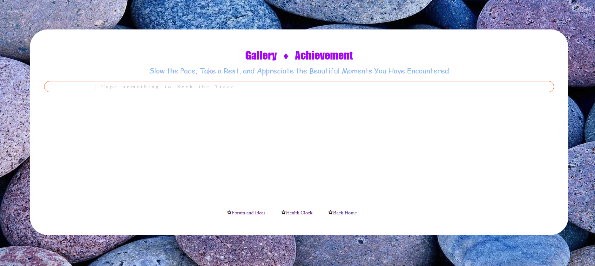

# A Concept about Self-Discipline App
**2023.1**
This was an early work of me when I just learnt HTML and CSS (without JavaScript) and attended DeltaHacks9 Hackathon.  
The topic was about creating something to help people with a healthier life, which made me think of an app to help keep track and be reminder of good sleep schedule, enough exercise, proper planning for todos, and healthy diet everyday. I did not know other proper app programming language so I used HTML and CSS to describe its functionality.  
"forum.html", "Home.html", "memo-gallery.html" were the files I made during competition, they were not interactive and lacked the "health.html" page at that moment, but I still liked the style and I completed that page later.  

 

## Demo Pictures

**Home-Panel Page Screenshot** 
 

 

**Health-Clock Page Screenshot**
 

 

**Forum-and-Ideas Page Screenshot**
 

 

**Memo-Gallery Page Screenshot**
 

 
