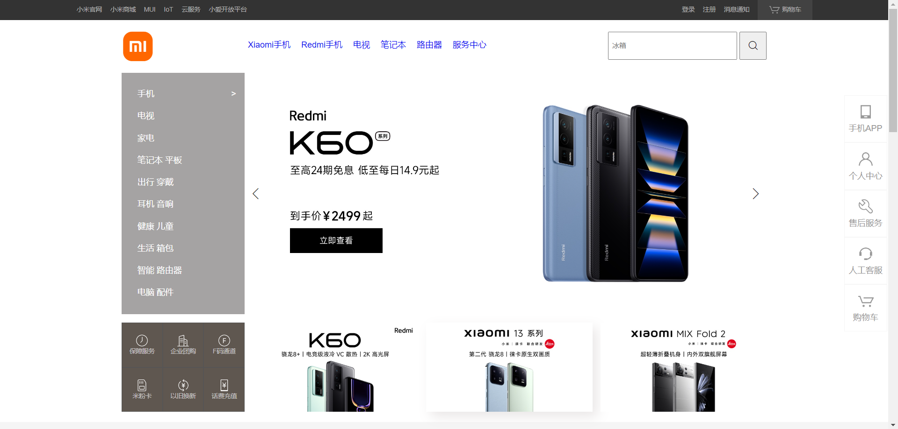
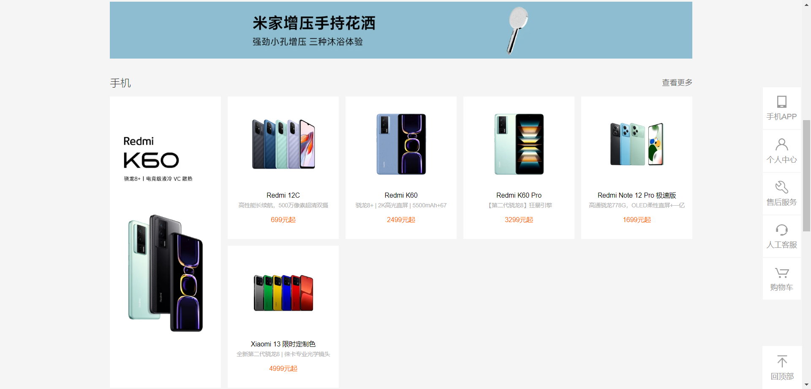
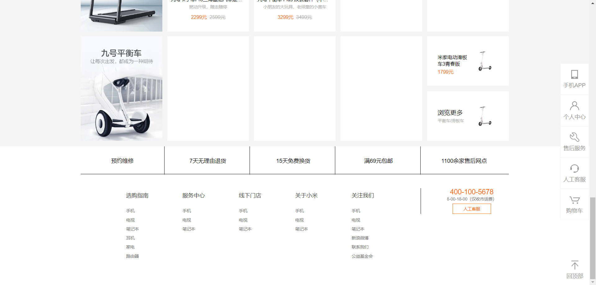
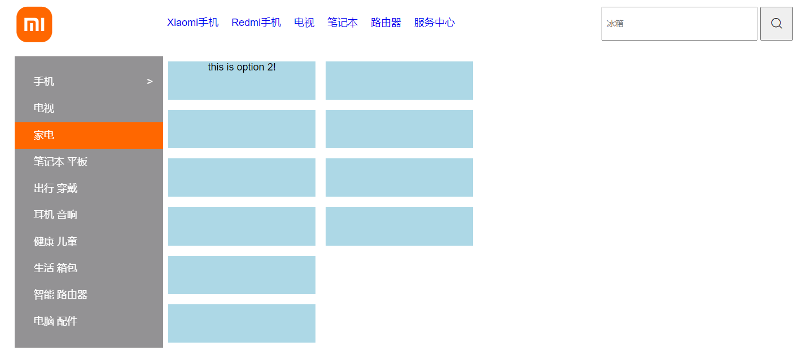
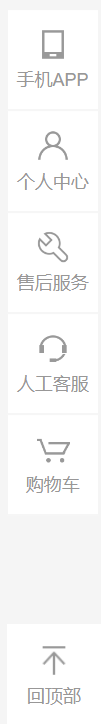
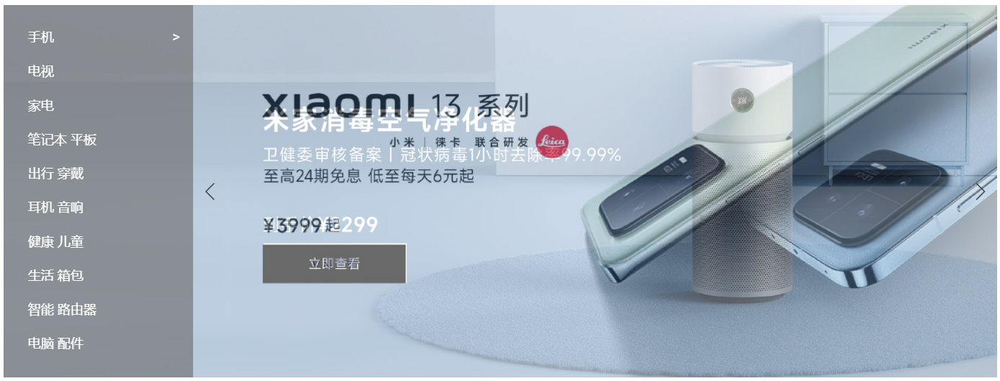

# Imitation of Xiaomi Online Shop Website
As a beginner, mimicking an existing website is a way to help improve web skills and train the mastery of building the frame and function for a website.  
The reference real website link is [here](https://www.mi.com/shop).  
 
 

## Screenshots of This Imitated Website

 

 

 
 
 

## Functions of This Imitation
**If the mouse hovers onto the side menu, it will be able to pop up the window with different contents**

 

**Go-to-Top button will be shown if scrolling down**

 

**Carousel slowly fading in and out automatically**

 
